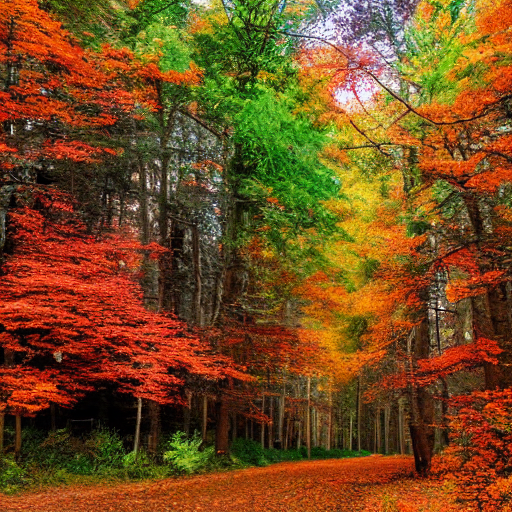

# Stable Diffusion Image Generator

This project generates images based on text prompts using the [Stable Diffusion](https://huggingface.co/CompVis/stable-diffusion-v-1-4) model. It provides a simple GUI interface for entering the text prompt and saves the generated images with a unique filename.

## Table of Contents
- [Features](#features)
- [Installation](#installation)
- [Usage](#usage)
- [Dependencies](#dependencies)
- [Project Structure](#project-structure)
- [Examples](#examples)
- [Contributing](#contributing)
- [License](#license)
- [Acknowledgements](#acknowledgements)

## Features
- **User-Friendly Interface**: Enter text prompts through a simple GUI dialog.
- **GPU Acceleration**: Utilizes GPU for faster image generation.
- **Automatic Saving**: Saves generated images with unique filenames based on timestamps.
- **Scalable**: Easy to modify and extend for various applications.

## Installation

1. **Clone the repository**:
    ```sh
    git clone https://github.com/yourusername/stable-diffusion-image-generator.git
    cd stable-diffusion-image-generator
    ```

2. **Create and activate a virtual environment** (optional but recommended):
    ```sh
    python -m venv venv
    source venv/bin/activate  # On Windows use `venv\Scripts\activate`
    ```

3. **Install the required dependencies**:
    ```sh
    pip install -r requirements.txt
    ```

## Usage

1. **Run the script**:
    ```sh
    python main.py
    ```

2. **Enter the text prompt**:
    - A dialog box will appear asking you to enter the text prompt for image generation. 
    - Enter the prompt and click "OK".

3. **View and save the image**:
    - The generated image will be displayed and saved in the `generated_images` directory with a unique filename.

## Dependencies

- `torch`: PyTorch for loading and running the model.
- `diffusers`: For loading the Stable Diffusion pipeline.
- `transformers`: Provides the Stable Diffusion model.
- `tk`: Tkinter for creating the GUI dialog.

## Project Structure
```sh
stable-diffusion-image-generator/
│
├── generated_images/ # Directory to store generated images
├── main.py # Main script for image generation
├── test.py # Test script to test if CUDA is properly installed and the number of GPUs available
├── requirements.txt # List of dependencies
├── README.md # Project description and usage
└── LICENSE # License for the project
```
## Examples

Here are some examples of images generated using different text prompts:

### Example 1: "A beautiful sunset over a mountain range"


### Example 2: "A futuristic cityscape at night"


### Example 3: "A serene beach with clear blue water"


### Example 4: "A vibrant forest in autumn"


Feel free to experiment with different prompts to generate a wide variety of images!


## Contributing

Contributions are welcome! Please follow these steps to contribute:

1. Fork the repository.
2. Create a new branch (`git checkout -b feature-branch`).
3. Make your changes.
4. Commit your changes (`git commit -m 'Add new feature'`).
5. Push to the branch (`git push origin feature-branch`).
6. Create a pull request.

## License

This project is licensed under the MIT License - see the [LICENSE](LICENSE) file for details.

## Acknowledgements

- The [CompVis](https://github.com/CompVis) team for developing the Stable Diffusion model.
- [Hugging Face](https://huggingface.co/) for providing the model and diffusion pipeline.
- The [PyTorch](https://pytorch.org/) community for the powerful deep learning framework.

---

Feel free to customize and enhance the text prompts to generate a variety of images. This project can serve as a foundation for more complex image generation tasks and applications. Happy generating!
